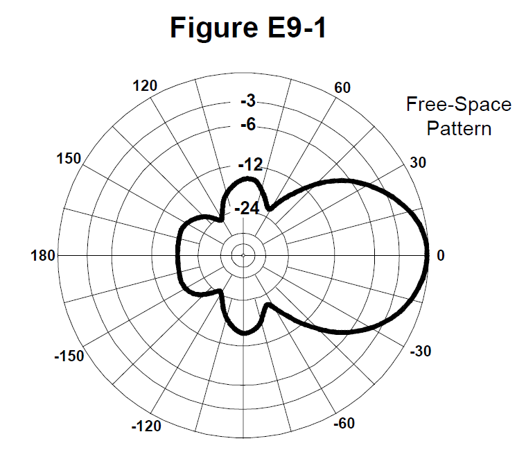
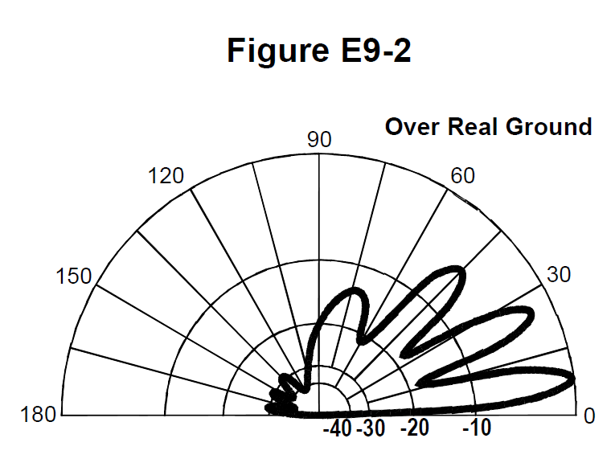
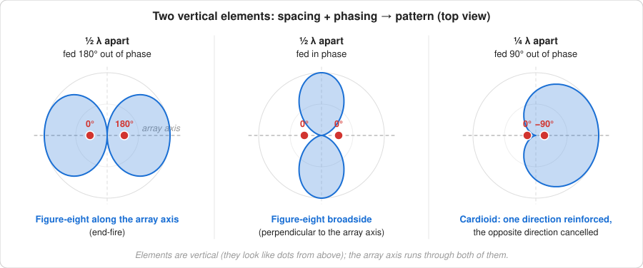
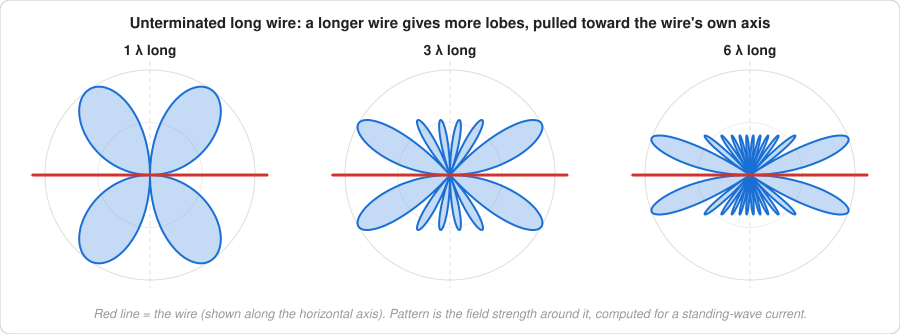
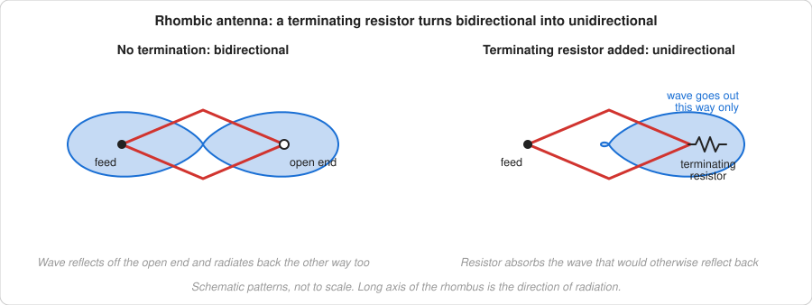
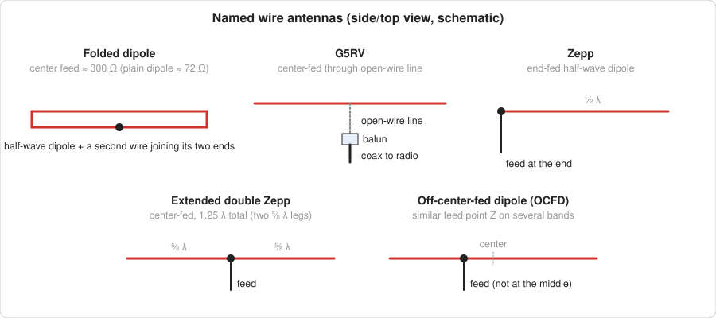
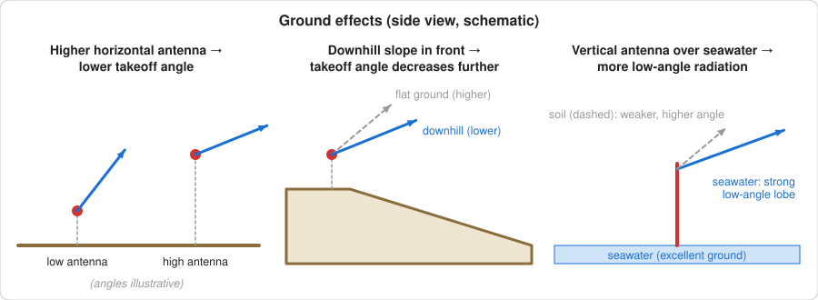
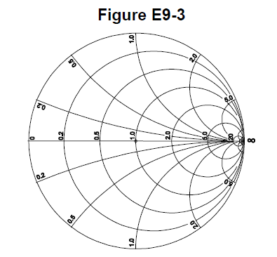

# E9 — Antennas and Transmission Lines

**8 of your 50 exam questions · 8 groups (E9A–E9H) · 93 questions in the pool**

This is the largest content subelement on the Extra exam, and it builds directly on General's G9
(4 groups: feed lines, SWR, and basic dipole/vertical behavior). E9 doubles that to eight groups and
goes much deeper: antenna gain math (dBi vs. dBd, ERP/EIRP conversions), radiation patterns and
computer antenna modeling, practical wire antennas and phased vertical arrays, Yagis and the theory
of loading electrically short antennas, five named impedance-matching systems, transmission-line
stub behavior and dielectrics, the Smith chart, and receiving-only antennas for direction finding.

Compared to G9, expect more arithmetic (dB-to-watts ERP/EIRP problems, a quarter-wavelength
transformer trick for matching-stub impedances) and more raw vocabulary — a long list of named
matching systems, Smith chart terminology, and pattern-recognition questions tied to two figures.
None of these questions cite Part 97; this is engineering, not regulation, so no citation tags appear
below.

## Table of Contents

- [E9A — Basic antenna parameters: radiation resistance, gain, beamwidth, efficiency; effective radiated power (ERP) and effective isotropic radiated power (EIRP)](#e9a--basic-antenna-parameters-radiation-resistance-gain-beamwidth-efficiency-effective-radiated-power-erp-and-effective-isotropic-radiated-power-eirp)
  - [All 12 pool questions for E9A](#all-12-pool-questions-for-e9a)
- [E9B — Antenna patterns and designs: azimuth and elevation patterns; gain as a function of pattern; antenna modeling](#e9b--antenna-patterns-and-designs-azimuth-and-elevation-patterns-gain-as-a-function-of-pattern-antenna-modeling)
  - [All 11 pool questions for E9B](#all-11-pool-questions-for-e9b)
- [E9C — Practical wire antennas; folded dipoles; phased arrays; effects of ground near antennas](#e9c--practical-wire-antennas-folded-dipoles-phased-arrays-effects-of-ground-near-antennas)
  - [All 14 pool questions for E9C](#all-14-pool-questions-for-e9c)
- [E9D — Yagi antennas; parabolic reflectors; feed point impedance and loading of electrically short antennas; antenna Q; RF grounding](#e9d--yagi-antennas-parabolic-reflectors-feed-point-impedance-and-loading-of-electrically-short-antennas-antenna-q-rf-grounding)
  - [All 12 pool questions for E9D](#all-12-pool-questions-for-e9d)
- [E9E — Impedance matching: matching antennas to feed lines; phasing lines; power dividers](#e9e--impedance-matching-matching-antennas-to-feed-lines-phasing-lines-power-dividers)
  - [All 10 pool questions for E9E](#all-10-pool-questions-for-e9e)
- [E9F — Transmission lines: characteristics of open and shorted feed lines; coax versus open wire; velocity factor; electrical length; coaxial cable dielectrics; microstrip](#e9f--transmission-lines-characteristics-of-open-and-shorted-feed-lines-coax-versus-open-wire-velocity-factor-electrical-length-coaxial-cable-dielectrics-microstrip)
  - [All 12 pool questions for E9F](#all-12-pool-questions-for-e9f)
- [E9G — The Smith chart](#e9g--the-smith-chart)
  - [All 11 pool questions for E9G](#all-11-pool-questions-for-e9g)
- [E9H — Receiving antennas: radio direction finding (RDF) techniques; Beverage antennas; single- and multiple-turn loops](#e9h--receiving-antennas-radio-direction-finding-rdf-techniques-beverage-antennas-single--and-multiple-turn-loops)
  - [All 11 pool questions for E9H](#all-11-pool-questions-for-e9h)

---

## E9A — Basic antenna parameters: radiation resistance, gain, beamwidth, efficiency; effective radiated power (ERP) and effective isotropic radiated power (EIRP)

*One exam question comes from this group. 12 questions in the pool.*

**Isotropic radiator** is a *hypothetical, lossless* antenna radiating equally in all directions — it
exists only as a mathematical reference for gain figures expressed in **dBi**. Gain over a
half-wave dipole is **dBd**, and the conversion is fixed: **dBd = dBi − 2.15 dB** (a dipole itself has
2.15 dBi of gain). E9A12 tests this directly: 6 dBi of gain is **3.85 dBd**.

**ERP vs. EIRP — same arithmetic, different reference.** Both are computed the same way: start with
transmitter power, subtract every dB of loss (feed line, duplexer, circulator), add the antenna gain
in dB, then convert the net dB back to a power ratio and multiply by the starting watts. The only
difference is which gain figure you're handed — **ERP uses gain in dBd** (relative to a dipole),
**EIRP uses gain in dBi** (relative to an isotropic radiator). Watch the label on the antenna gain
number in the question; that alone tells you which term you're calculating.

**Feed point impedance** is set by **antenna height** — not the tuner, not line length, not power
level. **Ground gain** is real signal-strength increase from **ground reflections** in the antenna's
environment, not literal amplification. **Fresnel zone size shrinks as frequency rises**, so of the
choices given, the highest frequency has the smallest first Fresnel zone. **Antenna efficiency** is
**radiation resistance divided by total resistance** (radiation resistance plus every loss
resistance in the system) — and for a ground-mounted quarter-wave vertical, the single biggest
efficiency lever is a good **ground radial system**, because **soil conductivity** is what drives
ground loss on HF.

#### All 12 pool questions for E9A

**E9A01**

What is an isotropic radiator?

- A. A calibrated, unidirectional antenna used to make precise antenna gain measurements
- B. An omnidirectional, horizontally polarized, precisely calibrated antenna used to make field measurements of antenna gain
- C. A hypothetical, lossless antenna having equal radiation intensity in all directions used as a reference for antenna gain
- D. A spacecraft antenna used to direct signals toward Earth
-
- Answer: C

**E9A02**

What is the effective radiated power (ERP) of a repeater station with 150 watts transmitter power output, 2 dB feed line loss, 2.2 dB duplexer loss, and 7 dBd antenna gain?

- A. 469 watts
- B. 78.7 watts
- C. 420 watts
- D. 286 watts
-
- Answer: D

**E9A03**

What term describing total radiated power takes into account all gains and losses?

- A. Power factor
- B. Half-power bandwidth
- C. Effective radiated power
- D. Apparent power
-
- Answer: C

**E9A04**

Which of the following factors affect the feed point impedance of an antenna?

- A. Transmission line length
- B. Antenna height
- C. The settings of an antenna tuner at the transmitter
- D. The input power level
-
- Answer: B

**E9A05**

What does the term "ground gain" mean?

- A. The change in signal strength caused by grounding the antenna
- B. The gain of the antenna with respect to a dipole at ground level
- C. To force net gain to 0 dB by grounding part of the antenna
- D. An increase in signal strength from ground reflections in the environment of the antenna
-
- Answer: D

**E9A06**

What is the effective radiated power (ERP) of a repeater station with 200 watts transmitter power output, 4 dB feed line loss, 3.2 dB duplexer loss, 0.8 dB circulator loss, and 10 dBd antenna gain?

- A. 317 watts
- B. 2,000 watts
- C. 126 watts
- D. 300 watts
-
- Answer: A

**E9A07**

What is the effective isotropic radiated power (EIRP) of a repeater station with 200 watts transmitter power output, 2 dB feed line loss, 2.8 dB duplexer loss, 1.2 dB circulator loss, and 7 dBi antenna gain?

- A. 159 watts
- B. 252 watts
- C. 632 watts
- D. 63.2 watts
-
- Answer: B

**E9A08**

Which frequency band has the smallest first Fresnel zone?

- A. 5.8 GHz
- B. 3.4 GHz
- C. 2.4 GHz
- D. 900 MHz
-
- Answer: A

**E9A09**

What is antenna efficiency?

- A. Radiation resistance divided by transmission resistance
- B. Radiation resistance divided by total resistance
- C. Total resistance divided by radiation resistance
- D. Effective radiated power divided by transmitter output
-
- Answer: B

**E9A10**

Which of the following improves the efficiency of a ground-mounted quarter-wave vertical antenna?

- A. Installing a ground radial system
- B. Isolating the coax shield from ground
- C. Shortening the radiating element
- D. All these choices are correct
-
- Answer: A

**E9A11**

Which of the following determines ground losses for a ground-mounted vertical antenna operating on HF?

- A. The standing wave ratio
- B. Distance from the transmitter
- C. Soil conductivity
- D. Take-off angle
-
- Answer: C

**E9A12**

How much gain does an antenna have compared to a half-wavelength dipole if it has 6 dB gain over an isotropic radiator?

- A. 3.85 dB
- B. 6.0 dB
- C. 8.15 dB
- D. 2.79 dB
-
- Answer: A

---

## E9B — Antenna patterns and designs: azimuth and elevation patterns; gain as a function of pattern; antenna modeling

*One exam question comes from this group. 11 questions in the pool.*

**Figures E9-1 and E9-2** are provided at the exam and drive six of these eleven questions — practice
reading the figures (shown with each question) before test day; the notes below explain what each term means, but the
actual numeric answers (beamwidth, front-to-back, front-to-side, elevation angle) come straight off
the plotted pattern. An **azimuth pattern** is a horizontal (compass-view) slice of the antenna's
radiation; an **elevation pattern** is a vertical slice showing how radiation varies with takeoff
angle — E9B05 tests recognizing which type Figure E9-2 is (elevation).

**Gain vs. pattern.** A lossless directional antenna and an isotropic radiator fed the *same* input
power radiate the *same total power* — gain doesn't create power, it redistributes it, concentrating
more of that same total into the main lobe direction at the expense of other directions. The
**far field** is the region where the radiation pattern's *shape* stops changing with distance (only
its strength falls off from there).

**Method of Moments** is the standard computer antenna-modeling technique: it breaks a wire into a
series of **segments, each carrying a uniform value of current**, and solves for the currents that
satisfy the boundary conditions. The practical rule of thumb is **at least 10 segments per
half-wavelength** — go below that and the **computed feed point impedance may become inaccurate**,
even though the pattern shape often still looks reasonable.

#### All 11 pool questions for E9B

**E9B01** &nbsp;·&nbsp; *refer to Figure E9-1*

What is the 3 dB beamwidth of the antenna radiation pattern shown in Figure E9-1?

- A. 75 degrees
- B. 50 degrees
- C. 25 degrees
- D. 30 degrees
-
- Answer: B

**E9B02** &nbsp;·&nbsp; *refer to Figure E9-1*

What is the front-to-back ratio of the antenna radiation pattern shown in Figure E9-1?

- A. 36 dB
- B. 14 dB
- C. 24 dB
- D. 18 dB
-
- Answer: D

**E9B03** &nbsp;·&nbsp; *refer to Figure E9-1*

What is the front-to-side ratio of the antenna radiation pattern shown in Figure E9-1?

- A. 12 dB
- B. 24 dB
- C. 18 dB
- D. 14 dB
-
- Answer: D

**E9B04** &nbsp;·&nbsp; *refer to Figure E9-2*

What is the front-to-back ratio of the radiation pattern shown in Figure E9-2?

- A. 15 dB
- B. 28 dB
- C. 3 dB
- D. 38 dB
-
- Answer: B

**E9B05** &nbsp;·&nbsp; *refer to Figure E9-2*

What type of antenna pattern is shown in Figure E9-2?

- A. Elevation
- B. Azimuth
- C. Near field
- D. Polarization
-
- Answer: A

**E9B06** &nbsp;·&nbsp; *refer to Figure E9-2*

What is the elevation angle of peak response in the antenna radiation pattern shown in Figure E9-2?

- A. 45 degrees
- B. 75 degrees
- C. 7.5 degrees
- D. 25 degrees
-
- Answer: C

**E9B07**

What is the difference in radiated power between a lossless antenna with gain and an isotropic radiator driven by the same power?

- A. The power radiated from the directional antenna is increased by the gain of the antenna
- B. The power radiated from the directional antenna is stronger by its front-to-back ratio
- C. They are the same
- D. The power radiated from the isotropic radiator is 2.15 dB greater than that from the directional antenna
-
- Answer: C

**E9B08**

What is the far field of an antenna?

- A. The region of the ionosphere where radiated power is not refracted
- B. The region where radiated power dissipates over a specified time period
- C. The region where radiated field strengths are constant
- D. The region where the shape of the radiation pattern no longer varies with distance
-
- Answer: D

**E9B09**

What type of analysis is commonly used for modeling antennas?

- A. Graphical analysis
- B. Method of Moments
- C. Mutual impedance analysis
- D. Calculus differentiation with respect to physical properties
-
- Answer: B

**E9B10**

What is the principle of a Method of Moments analysis?

- A. A wire is modeled as a series of segments, each having a uniform value of current
- B. A wire is modeled as a single sine-wave current generator
- C. A wire is modeled as a single sine-wave voltage source
- D. A wire is modeled as a series of segments, each having a distinct value of voltage across it
-
- Answer: A

**E9B11**

What is a disadvantage of decreasing the number of wire segments in an antenna model below 10 segments per half-wavelength?

- A. Ground conductivity will not be accurately modeled
- B. The resulting design will favor radiation of harmonic energy
- C. The computed feed point impedance may be incorrect
- D. The antenna will become mechanically unstable
-
- Answer: C

---

## E9C — Practical wire antennas; folded dipoles; phased arrays; effects of ground near antennas

*One exam question comes from this group. 14 questions in the pool.*

**Two-vertical phased array cheat sheet (three questions, all variations of the same pair of
antennas):** spacing **1/2 wavelength, fed 180° out of phase** gives a **figure-eight along the axis**
of the array (end-fire); spacing **1/2 wavelength, fed in phase** gives a **figure-eight broadside**
to the axis; spacing **1/4 wavelength, fed 90° out of phase** gives a **cardioid** — one direction
reinforced, the other cancelled. Memorize spacing+phasing → pattern as a triplet.

**Long wire and rhombic antennas.** As an unterminated long wire gets longer, it sprouts **more
lobes, increasingly aligned with the wire's own axis** rather than broadside to it. Adding a
**terminating resistor** to a rhombic or long-wire changes the pattern from **bidirectional to
unidirectional**, by absorbing the wave that would otherwise reflect back and radiate the other way.

**Named wire antennas.** A **folded dipole** is a half-wave dipole with a **second wire connecting
its two ends**, and its center feed point impedance is about **300 ohms** (four times a plain
dipole's ~72 ohms). A **G5RV** is center-fed through a specific length of **open-wire line into a
balun and coax**. A **Zepp** is an **end-fed half-wave dipole**; an **extended double Zepp** stretches
that to a **center-fed 1.25-wavelength** dipole for extra gain. An **off-center-fed dipole (OCFD)**
is fed off-midpoint specifically to give a **similar feed point impedance across multiple bands**.

**Ground effects.** Vertically polarized low-angle radiation **increases** over **seawater** compared
to soil, because seawater is a far better ground conductor and loses less energy to the earth. For a
**horizontally polarized** antenna, raising it higher **decreases the takeoff angle** of its lowest
lobe; mounted over a **downhill slope**, that takeoff angle **decreases further** in the downhill
direction, effectively raising the antenna's height relative to the terrain it's shooting over.

#### All 14 pool questions for E9C

**E9C01**

What type of radiation pattern is created by two 1/4-wavelength vertical antennas spaced 1/2-wavelength apart and fed 180 degrees out of phase?

- A. Cardioid
- B. Omni-directional
- C. A figure-eight broadside to the axis of the array
- D. A figure-eight oriented along the axis of the array
-
- Answer: D

**E9C02**

What type of radiation pattern is created by two 1/4-wavelength vertical antennas spaced 1/4-wavelength apart and fed 90 degrees out of phase?

- A. Cardioid
- B. A figure-eight end-fire along the axis of the array
- C. A figure-eight broadside to the axis of the array
- D. Omni-directional
-
- Answer: A

**E9C03**

What type of radiation pattern is created by two 1/4-wavelength vertical antennas spaced 1/2-wavelength apart and fed in phase?

- A. Omni-directional
- B. Cardioid
- C. A figure-eight broadside to the axis of the array
- D. A figure-eight end-fire along the axis of the array
-
- Answer: C

**E9C04**

What happens to the radiation pattern of an unterminated long wire antenna as the wire length is increased?

- A. Fewer lobes form with the major lobes increasing closer to broadside to the wire
- B. Additional lobes form with major lobes increasingly aligned with the axis of the antenna
- C. The elevation angle increases, and the front-to-rear ratio decreases
- D. The elevation angle increases, while the front-to-rear ratio is unaffected
-
- Answer: B

**E9C05**

What is the purpose of feeding an off-center-fed dipole (OCFD) between the center and one end instead of at the midpoint?

- A. To create a similar feed point impedance on multiple bands
- B. To suppress off-center lobes at higher frequencies
- C. To resonate the antenna across a wider range of frequencies
- D. To reduce common-mode current coupling on the feed line shield
-
- Answer: A

**E9C06**

What is the effect of adding a terminating resistor to a rhombic or long-wire antenna?

- A. It reflects the standing waves on the antenna elements back to the transmitter
- B. It changes the radiation pattern from bidirectional to unidirectional
- C. It changes the radiation pattern from horizontal to vertical polarization
- D. It decreases the ground loss
-
- Answer: B

**E9C07**

What is the approximate feed point impedance at the center of a two-wire half-wave folded dipole antenna?

- A. 300 ohms
- B. 72 ohms
- C. 50 ohms
- D. 450 ohms
-
- Answer: A

**E9C08**

What is a folded dipole antenna?

- A. A dipole one-quarter wavelength long
- B. A center-fed dipole with the ends folded down 90 degrees at the midpoint of each side
- C. A half-wave dipole with an additional parallel wire connecting its two ends
- D. A dipole configured to provide forward gain
-
- Answer: C

**E9C09**

Which of the following describes a G5RV antenna?

- A. A wire antenna center-fed through a specific length of open-wire line connected to a balun and coaxial feed line
- B. A multi-band trap antenna
- C. A phased array antenna consisting of multiple loops
- D. A wide band dipole using shorted coaxial cable for the radiating elements and fed with a 4:1 balun
-
- Answer: A

**E9C10**

Which of the following describes a Zepp antenna?

- A. A horizontal array capable of quickly changing the direction of maximum radiation by changing phasing lines
- B. An end-fed half-wavelength dipole
- C. An omni-directional antenna commonly used for satellite communications
- D. A vertical array capable of quickly changing the direction of maximum radiation by changing phasing lines
-
- Answer: B

**E9C11**

How is the far-field elevation pattern of a vertically polarized antenna affected by being mounted over seawater versus soil?

- A. Radiation at low angles decreases
- B. Additional lobes appear at higher elevation angles
- C. Separate elevation lobes will combine into a single lobe
- D. Radiation at low angles increases
-
- Answer: D

**E9C12**

Which of the following describes an extended double Zepp antenna?

- A. An end-fed full-wave dipole antenna
- B. A center-fed 1.5-wavelength dipole antenna
- C. A center-fed 1.25-wavelength dipole antenna
- D. An end-fed 2-wavelength dipole antenna
-
- Answer: C

**E9C13**

How does the radiation pattern of a horizontally polarized antenna vary with increasing height above ground?

- A. The takeoff angle of the lowest elevation lobe increases
- B. The takeoff angle of the lowest elevation lobe decreases
- C. The horizontal beamwidth increases
- D. The horizontal beamwidth decreases
-
- Answer: B

**E9C14**

How does the radiation pattern of a horizontally-polarized antenna mounted above a long slope compare with the same antenna mounted above flat ground?

- A. The main lobe takeoff angle increases in the downhill direction
- B. The main lobe takeoff angle decreases in the downhill direction
- C. The horizontal beamwidth decreases in the downhill direction
- D. The horizontal beamwidth increases in the uphill direction
-
- Answer: B

---

## E9D — Yagi antennas; parabolic reflectors; feed point impedance and loading of electrically short antennas; antenna Q; RF grounding

*One exam question comes from this group. 12 questions in the pool.*

**Parabolic dish gain** scales with the dish's electrical size, so doubling frequency (halving
wavelength) quadruples the aperture-to-wavelength ratio and adds **6 dB** of gain. **Circular
polarization from two Yagis** requires crossing them: mount two linear Yagis **on the same axis,
perpendicular to each other, driven elements at the same point on the boom, fed 90 degrees out of
phase**.

**Loading a physically short antenna** compensates for the capacitive reactance a too-short radiator
presents below resonance. A loading coil's **inductive reactance cancels that capacitive
reactance**, which is the entire function of the coil. Coils should have a **high reactance-to-
resistance ratio (high Q)** to **maximize efficiency** — a lossy coil just burns power as heat instead
of radiating it. **Center loading is more efficient than base loading** on a short vertical whip,
because it puts the coil where the current is higher along the radiator. **Top loading**, by
contrast, is prized for **improved radiation efficiency**, since it raises the current maximum even
higher and increases effective height.

**Q and bandwidth are inversely linked**, on any resonant circuit including an antenna: loading a
short antenna to resonance raises its Q, which **decreases its SWR bandwidth**. A **Yagi's driven
element is about 1/2 wavelength** long — that's the baseline; the **parasitic elements** (reflector,
directors) are deliberately made longer or shorter than resonance specifically to **control the
phase shift** of their induced currents, which is what produces gain and front-to-back ratio. Most
two-element Yagis use a **reflector rather than a director** because that configuration yields
**higher gain**. Below resonance, a base-fed whip's **radiation resistance decreases**.

#### All 12 pool questions for E9D

**E9D01**

How much does the gain of an ideal parabolic reflector antenna increase when the operating frequency is doubled?

- A. 2 dB
- B. 3 dB
- C. 4 dB
- D. 6 dB
-
- Answer: D

**E9D02**

How can two linearly polarized Yagi antennas be used to produce circular polarization?

- A. Stack two Yagis to form an array with the respective elements in parallel planes fed 90 degrees out of phase
- B. Stack two Yagis to form an array with the respective elements in parallel planes fed in phase
- C. Arrange two Yagis on the same axis and perpendicular to each other with the driven elements at the same point on the boom and fed 90 degrees out of phase
- D. Arrange two Yagis collinear to each other with the driven elements fed 180 degrees out of phase
-
- Answer: C

**E9D03**

What is the most efficient location for a loading coil on an electrically short whip?

- A. Near the center of the vertical radiator
- B. As low as possible on the vertical radiator
- C. At a voltage maximum
- D. At a voltage null
-
- Answer: A

**E9D04**

Why should antenna loading coils have a high ratio of reactance to resistance?

- A. To swamp out harmonics
- B. To lower the radiation angle
- C. To maximize efficiency
- D. To minimize the Q
-
- Answer: C

**E9D05**

Approximately how long is a Yagi's driven element?

- A. 234 divided by frequency in MHz
- B. 1005 divided by frequency in MHz
- C. 1/4 wavelength
- D. 1/2 wavelength
-
- Answer: D

**E9D06**

What happens to SWR bandwidth when one or more loading coils are used to resonate an electrically short antenna?

- A. It is increased
- B. It is decreased
- C. It is unchanged if the loading coil is located at the feed point
- D. It is unchanged if the loading coil is located at a voltage maximum point
-
- Answer: B

**E9D07**

What is an advantage of top loading an electrically short HF vertical antenna?

- A. Lower Q
- B. Greater structural strength
- C. Higher losses
- D. Improved radiation efficiency
-
- Answer: D

**E9D08**

What happens as the Q of an antenna increases?

- A. SWR bandwidth increases
- B. SWR bandwidth decreases
- C. Gain is reduced
- D. More common-mode current is present on the feed line
-
- Answer: B

**E9D09**

What is the function of a loading coil in an electrically short antenna?

- A. To increase the SWR bandwidth by increasing net reactance
- B. To lower the losses
- C. To lower the Q
- D. To resonate the antenna by cancelling the capacitive reactance
-
- Answer: D

**E9D10**

How does radiation resistance of a base-fed whip antenna change below its resonant frequency?

- A. Radiation resistance increases
- B. Radiation resistance decreases
- C. Radiation resistance becomes imaginary
- D. Radiation resistance does not depend on frequency
-
- Answer: B

**E9D11**

Why do most two-element Yagis with normal spacing have a reflector instead of a director?

- A. Lower SWR
- B. Higher receiving directivity factor
- C. Greater front-to-side
- D. Higher gain
-
- Answer: D

**E9D12**

What is the purpose of making a Yagi's parasitic elements either longer or shorter than resonance?

- A. Wind torque cancellation
- B. Mechanical balance
- C. Control of phase shift
- D. Minimize losses
-
- Answer: C

---

## E9E — Impedance matching: matching antennas to feed lines; phasing lines; power dividers

*One exam question comes from this group. 10 questions in the pool.*

**Five named Yagi/vertical matching systems, by what they need:** a **gamma match** connects the coax
shield to the center of the antenna and the center conductor a fraction of a wavelength to one side —
its series **capacitor cancels the unwanted inductive reactance** the offset gamma rod introduces. A
**beta (hairpin) match** requires the **driven element insulated from the boom**, and needs the
driven element's feed point impedance to be **capacitive** (i.e., electrically shorter than 1/2
wavelength) for the hairpin's inductance to cancel it. A **T-match** and a **delta match** are the
other two direct feed-point matches; a **stub match** instead uses a **short length of transmission
line connected in parallel with the feed line** at or near the feed point. Any of these except the
T-match/beta family can be used to **shunt-feed a grounded tower at its base** — the gamma match is
the textbook answer here.

**Q-section (quarter-wave transformer):** the matching-line impedance is the **geometric mean** of the
two impedances it joins — √(100 × 50) ≈ 71 ohms, so of standard values, **75 ohms** is the practical
choice for matching a 100-ohm feed point to 50-ohm coax.

**Two remaining terms.** The **reflection coefficient** is the parameter describing the interaction
between a load and a transmission line (how much of the incident wave bounces back). A **Wilkinson
divider** splits power **equally between two 50-ohm loads while presenting a 50-ohm input impedance**
— it's a power splitter/combiner, not an impedance step-up device. **Multiple driven elements fed
through phasing lines** exist specifically **to control the antenna's radiation pattern**.

**Numbering note:** E9E10 was withdrawn by errata; the group keeps its original 1–11 numbering with
that number simply skipped, so E9E jumps from E9E09 to E9E11 below.

#### All 10 pool questions for E9E

**E9E01**

Which matching system for Yagi antennas requires the driven element to be insulated from the boom?

- A. Gamma
- B. Beta or hairpin
- C. Shunt-fed
- D. T-match
-
- Answer: B

**E9E02**

What antenna matching system matches coaxial cable to an antenna by connecting the shield to the center of the antenna and the conductor a fraction of a wavelength to one side?

- A. Gamma match
- B. Delta match
- C. T-match
- D. Stub match
-
- Answer: A

**E9E03**

What matching system uses a short length of transmission line connected in parallel with the feed line at or near the feed point?

- A. Gamma match
- B. Delta match
- C. T-match
- D. Stub match
-
- Answer: D

**E9E04**

What is the purpose of the series capacitor in a gamma match?

- A. To provide DC isolation between the feed line and the antenna
- B. To cancel unwanted inductive reactance
- C. To provide a rejection notch that prevents the radiation of harmonics
- D. To transform the antenna impedance to a higher value
-
- Answer: B

**E9E05**

What Yagi driven element feed point impedance is required to use a beta or hairpin matching system?

- A. Capacitive (driven element electrically shorter than 1/2 wavelength)
- B. Inductive (driven element electrically longer than 1/2 wavelength)
- C. Purely resistive
- D. Purely reactive
-
- Answer: A

**E9E06**

Which of these transmission line impedances would be suitable for constructing a quarter-wave Q-section for matching a 100-ohm feed point impedance to a 50-ohm transmission line?

- A. 50 ohms
- B. 62 ohms
- C. 75 ohms
- D. 90 ohms
-
- Answer: C

**E9E07**

What parameter describes the interaction of a load and transmission line?

- A. Characteristic impedance
- B. Reflection coefficient
- C. Velocity factor
- D. Dielectric constant
-
- Answer: B

**E9E08**

What is a use for a Wilkinson divider?

- A. To divide the operating frequency of a transmitter signal so it can be used on a lower frequency band
- B. To feed high-impedance antennas from a low-impedance source
- C. To divide power equally between two 50-ohm loads while maintaining 50-ohm input impedance
- D. To divide the frequency of the input to a counter to increase its frequency range
-
- Answer: C

**E9E09**

Which of the following is used to shunt feed a grounded tower at its base?

- A. Double-bazooka match
- B. Beta or hairpin match
- C. Gamma match
- D. All these choices are correct
-
- Answer: C

**E9E11**

What is the purpose of using multiple driven elements connected through phasing lines?

- A. To control the antenna's radiation pattern
- B. To prevent harmonic radiation from the transmitter
- C. To allow single-band antennas to operate on other bands
- D. To create a low-angle radiation pattern
-
- Answer: A

---

## E9F — Transmission lines: characteristics of open and shorted feed lines; coax versus open wire; velocity factor; electrical length; coaxial cable dielectrics; microstrip

*One exam question comes from this group. 12 questions in the pool.*

**Velocity factor** is the **velocity of a wave in the line divided by the velocity of light in a
vacuum** — always less than 1 — and it's set mostly by the **insulating dielectric material**, not
impedance, length, or conductor resistivity. Because the wave travels **more slowly** in a coax than
in free space, the cable's **electrical length is longer than its physical length**.

**Stub impedance rules — the highest-yield pattern in this group.** A shorted or open stub's input
impedance depends on its electrical length relative to a quarter wavelength, and it flips at every
quarter wave:
- **Shorted, 1/4 wavelength → very high impedance** (a short gets inverted to an open).
- **Shorted, 1/2 wavelength → very low impedance** (repeats the short).
- **Open, 1/4 wavelength → very low impedance** (an open gets inverted to a short).
- **Shorted or open, less than 1/4 wavelength → reactive, not resistive:** a short stub under 1/4
  wave looks **inductive**; an open stub under 1/4 wave looks **capacitive**.

**Cable construction.** Foam-dielectric coax, versus solid dielectric otherwise identical, has
**lower loss per length**, a **higher velocity factor**, and a **lower safe maximum operating
voltage** — "all of these" is correct because foam trades away voltage handling for better RF
performance (more air, less material). **Parallel-conductor (open-wire) line has lower loss** than
plastic-dielectric coax, largely because its dielectric is mostly air. **Microstrip** is precision
printed-circuit conductors over a ground plane providing constant-impedance interconnects at
microwave frequencies — not literal coax or shielding material.

#### All 12 pool questions for E9F

**E9F01**

What is the velocity factor of a transmission line?

- A. The ratio of its characteristic impedance to its termination impedance
- B. The ratio of its termination impedance to its characteristic impedance
- C. The velocity of a wave in the transmission line multiplied by the velocity of light in a vacuum
- D. The velocity of a wave in the transmission line divided by the velocity of light in a vacuum
-
- Answer: D

**E9F02**

Which of the following has the biggest effect on the velocity factor of a transmission line?

- A. The characteristic impedance
- B. The transmission line length
- C. The insulating dielectric material
- D. The center conductor resistivity
-
- Answer: C

**E9F03**

Why is the electrical length of a coaxial cable longer than its physical length?

- A. Skin effect is less pronounced in the coaxial cable
- B. Skin effect is more pronounced in the coaxial cable
- C. Electromagnetic waves move faster in coaxial cable than in air
- D. Electromagnetic waves move more slowly in a coaxial cable than in air
-
- Answer: D

**E9F04**

What impedance does a 1/2-wavelength transmission line present to an RF generator when the line is shorted at the far end?

- A. Very high impedance
- B. Very low impedance
- C. The same as the characteristic impedance of the line
- D. The same as the output impedance of the RF generator
-
- Answer: B

**E9F05**

What is microstrip?

- A. Special shielding material designed for microwave frequencies
- B. Miniature coax used for low power applications
- C. Short lengths of coax mounted on printed circuit boards to minimize time delay between microwave circuits
- D. Precision printed circuit conductors above a ground plane that provide constant impedance interconnects at microwave frequencies
-
- Answer: D

**E9F06**

What is the approximate physical length of an air-insulated, parallel conductor transmission line that is electrically 1/2 wavelength long at 14.10 MHz?

- A. 7.0 meters
- B. 8.5 meters
- C. 10.6 meters
- D. 13.3 meters
-
- Answer: C

**E9F07**

How does parallel conductor transmission line compare to coaxial cable with a plastic dielectric?

- A. Lower loss
- B. Higher SWR
- C. Smaller reflection coefficient
- D. Lower velocity factor
-
- Answer: A

**E9F08**

Which of the following is a significant difference between foam dielectric coaxial cable and solid dielectric coaxial cable, assuming all other parameters are the same?

- A. Foam dielectric coaxial cable has lower safe maximum operating voltage
- B. Foam dielectric coaxial cable has lower loss per unit of length
- C. Foam dielectric coaxial cable has higher velocity factor
- D. All these choices are correct
-
- Answer: D

**E9F09**

What impedance does a 1/4-wavelength transmission line present to an RF generator when the line is shorted at the far end?

- A. Very high impedance
- B. Very low impedance
- C. The same as the characteristic impedance of the transmission line
- D. The same as the generator output impedance
-
- Answer: A

**E9F10**

What impedance does a 1/8-wavelength transmission line present to an RF generator when the line is shorted at the far end?

- A. A capacitive reactance
- B. The same as the characteristic impedance of the line
- C. An inductive reactance
- D. Zero
-
- Answer: C

**E9F11**

What impedance does a 1/8-wavelength transmission line present to an RF generator when the line is open at the far end?

- A. The same as the characteristic impedance of the line
- B. An inductive reactance
- C. A capacitive reactance
- D. Infinite
-
- Answer: C

**E9F12**

What impedance does a 1/4-wavelength transmission line present to an RF generator when the line is open at the far end?

- A. The same as the characteristic impedance of the line
- B. The same as the input impedance to the generator
- C. Very high impedance
- D. Very low impedance
-
- Answer: D

---

## E9G — The Smith chart

*One exam question comes from this group. 11 questions in the pool.*

**What it's for.** A Smith chart is used to **calculate impedance along transmission lines**, and in
practice its most common uses are finding **impedance and SWR values in transmission lines** and
**determining the length and position of an impedance matching stub** — not antenna gain, not
propagation, not radiation patterns.

**How it's built.** The chart's coordinate system is made of **resistance circles and reactance
arcs** — those are the two families of curves. The **large outer circle**, where every reactance arc
terminates, is the **reactance axis**; the **only straight line** on the whole chart is the
**resistance axis**, running horizontally through the center. **Circles represent constant
resistance; arcs represent constant reactance** — keep that pairing straight, since the exam likes to
swap which shape goes with which quantity.

**Normalizing and extras.** A chart is normalized by **reassigning the impedance value of the prime
center** (rescaling everything to that reference, commonly 50 ohms). When designing matching
networks, a **third family of constant-SWR circles** is often overlaid on top of the resistance and
reactance families. Finally, the **wavelength scales** around the chart's rim are calibrated in
**fractions of a transmission line's electrical wavelength**, used for tracking how impedance rotates
as you move along a line.

#### All 11 pool questions for E9G

**E9G01**

Which of the following can be calculated using a Smith chart?

- A. Impedance along transmission lines
- B. Radiation resistance
- C. Antenna radiation pattern
- D. Radio propagation
-
- Answer: A

**E9G02**

What type of coordinate system is used in a Smith chart?

- A. Voltage circles and current arcs
- B. Resistance circles and reactance arcs
- C. Voltage chords and current chords
- D. Resistance lines and reactance chords
-
- Answer: B

**E9G03**

Which of the following is often determined using a Smith chart?

- A. Beam headings and radiation patterns
- B. Satellite azimuth and elevation bearings
- C. Impedance and SWR values in transmission lines
- D. Point-to-point propagation reliability as a function of frequency
-
- Answer: C

**E9G04**

What are the two families of circles and arcs that make up a Smith chart?

- A. Inductance and capacitance
- B. Reactance and voltage
- C. Resistance and reactance
- D. Voltage and impedance
-
- Answer: C

**E9G05**

Which of the following is a common use for a Smith chart?

- A. Determine the length and position of an impedance matching stub
- B. Determine the impedance of a transmission line, given the physical dimensions
- C. Determine the gain of an antenna given the physical and electrical parameters
- D. Determine the loss/100 feet of a transmission line, given the velocity factor and conductor materials
-
- Answer: A

**E9G06**

On the Smith chart shown in Figure E9-3, what is the name for the large outer circle on which the reactance arcs terminate?

- A. Prime axis
- B. Reactance axis
- C. Impedance axis
- D. Polar axis
-
- Answer: B

**E9G07**

On the Smith chart shown in Figure E9-3, what is the only straight line shown?

- A. The reactance axis
- B. The current axis
- C. The voltage axis
- D. The resistance axis
-
- Answer: D

**E9G08**

How is a Smith chart normalized?

- A. Reassign the reactance axis with resistance values
- B. Reassign the resistance axis with reactance values
- C. Reassign the prime center's impedance value
- D. Reassign the prime center to the reactance axis
-
- Answer: C

**E9G09**

What third family of circles is often added to a Smith chart during the process of designing impedance matching networks?

- A. Constant-SWR circles
- B. Transmission line length circles
- C. Coaxial-length circles
- D. Radiation-pattern circles
-
- Answer: A

**E9G10**

What do the arcs on a Smith chart represent?

- A. Frequency
- B. SWR
- C. Points with constant resistance
- D. Points with constant reactance
-
- Answer: D

**E9G11**

In what units are the wavelength scales on a Smith chart calibrated?

- A. In fractions of transmission line electrical frequency
- B. In fractions of transmission line electrical wavelength
- C. In fractions of antenna electrical wavelength
- D. In fractions of antenna electrical frequency
-
- Answer: B

---

## E9H — Receiving antennas: radio direction finding (RDF) techniques; Beverage antennas; single- and multiple-turn loops

*One exam question comes from this group. 11 questions in the pool.*

**Beverage antenna.** A long, low, horizontal receiving-only wire: it should be **at least one
wavelength long**, and its **terminating resistor's** job is to **absorb signals arriving from the
reverse direction**, giving the antenna its directivity. The right terminating resistance is the one
that produces the **minimum variation in SWR over the desired frequency range** — a broadband match,
not a peak reading. On **160 and 80 meters**, atmospheric noise is so high that **directivity matters
far more than losses** — a lossy but directional receiving antenna still outperforms an efficient
omnidirectional one, because it nulls noise as much as it nulls unwanted signals.

**Small loops for direction finding.** A small loop has a natural **figure-eight (bidirectional)
null** pattern — its challenge for DF work is precisely that the null doesn't tell you which of two
opposite directions the signal came from. A **sense antenna** fixes this by adding a small omni
signal to the loop's pattern, producing a **cardioid with a single null**, which resolves the 180°
ambiguity — that single null is exactly what makes cardioid patterns valuable for DF work. An
**electrostatic shield** around a small loop **eliminates unbalanced capacitive coupling** to
surroundings, **deepening the null**.

**Receiving directivity factor (RDF)** is a formal figure of merit: **peak antenna gain compared to
the average gain over the hemisphere** around and above the antenna — not simply front-to-back, and
not gain relative to isotropic or a dipole. A **single-turn terminated loop**, such as a pennant
antenna, produces a **cardioid** pattern. For a **multi-turn receiving loop**, output voltage goes up
by **increasing the number of turns and/or the enclosed area** — more flux linkage, more induced
voltage.

#### All 11 pool questions for E9H

**E9H01**

When constructing a Beverage antenna, which of the following factors should be included in the design to achieve good performance at the desired frequency?

- A. Its overall length must not exceed 1/4 wavelength
- B. It must be mounted more than 1 wavelength above ground
- C. It should be configured as a four-sided loop
- D. It should be at least one wavelength long
-
- Answer: D

**E9H02**

Which is generally true for 160- and 80-meter receiving antennas?

- A. Atmospheric noise is so high that directivity is much more important than losses
- B. They must be erected at least 1/2 wavelength above the ground to attain good directivity
- C. Low loss coax transmission line is essential for good performance
- D. All these choices are correct
-
- Answer: A

**E9H03**

What is receiving directivity factor (RDF)?

- A. Forward gain compared to the gain in the reverse direction
- B. Relative directivity compared to isotropic
- C. Relative directivity compared to a dipole
- D. Peak antenna gain compared to average gain over the hemisphere around and above the antenna
-
- Answer: D

**E9H04**

What is the purpose of placing an electrostatic shield around a small-loop direction-finding antenna?

- A. It adds capacitive loading, increasing the bandwidth of the antenna
- B. It eliminates unbalanced capacitive coupling to the antenna's surroundings, improving the depth of its nulls
- C. It eliminates tracking errors caused by strong out-of-band signals
- D. It increases signal strength by providing a better match to the feed line
-
- Answer: B

**E9H05**

What challenge is presented by a small wire-loop antenna for direction finding?

- A. It has a bidirectional null pattern
- B. It does not have a clearly defined null
- C. It is practical for use only on VHF and higher bands
- D. All these choices are correct
-
- Answer: A

**E9H06**

What indicates the correct value of terminating resistance for a Beverage antenna?

- A. Maximum feed point DC resistance at the center of the desired frequency range
- B. Minimum low-angle front-to-back ratio at the design frequency
- C. Maximum DC current in the terminating resistor
- D. Minimum variation in SWR over the desired frequency range
-
- Answer: D

**E9H07**

What is the function of a Beverage antenna's termination resistor?

- A. Increase the front-to-side ratio
- B. Absorb signals from the reverse direction
- C. Decrease SWR bandwidth
- D. Eliminate harmonic reception
-
- Answer: B

**E9H08**

What is the function of a sense antenna?

- A. It modifies the pattern of a DF antenna to provide a null in only one direction
- B. It increases the sensitivity of a DF antenna array
- C. It allows DF antennas to receive signals at different vertical angles
- D. It provides diversity reception that cancels multipath signals
-
- Answer: A

**E9H09**

What type of radiation pattern is created by a single-turn, terminated loop such as a pennant antenna?

- A. Cardioid
- B. Bidirectional
- C. Omnidirectional
- D. Hyperbolic
-
- Answer: A

**E9H10**

How can the output voltage of a multiple-turn receiving loop antenna be increased?

- A. By reducing the permeability of the loop shield
- B. By utilizing high impedance wire for the coupling loop
- C. By increasing the number of turns and/or the area enclosed by the loop
- D. All these choices are correct
-
- Answer: C

**E9H11**

What feature of a cardioid pattern antenna makes it useful for direction-finding antennas?

- A. A very sharp peak
- B. A single null
- C. Broadband response
- D. High radiation angle
-
- Answer: B
