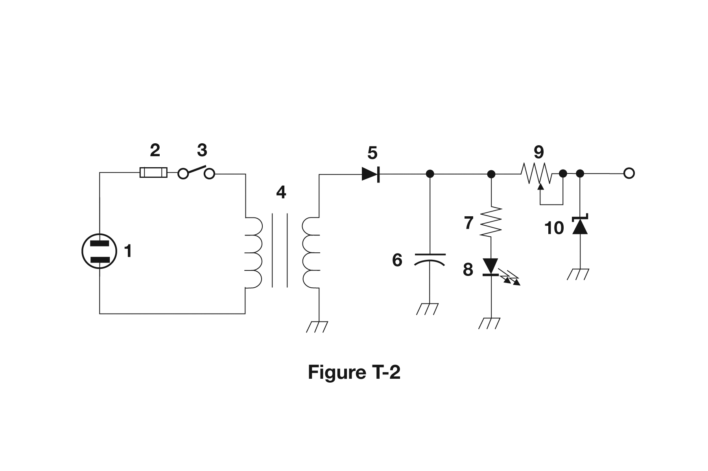
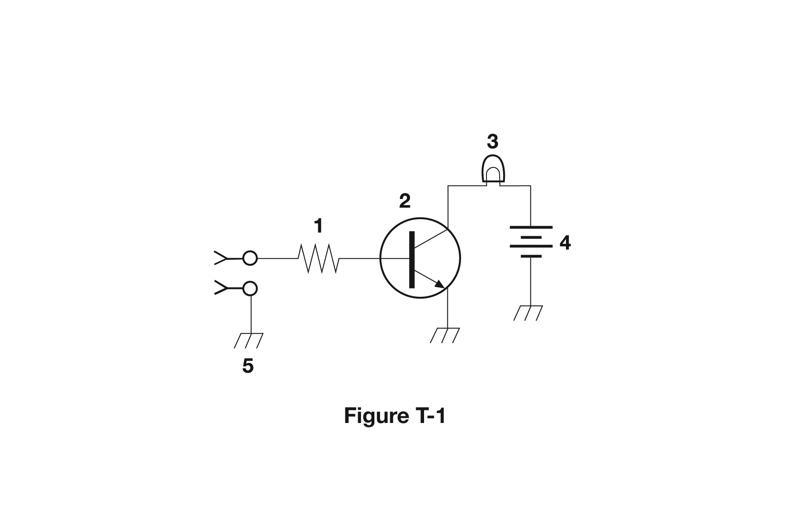
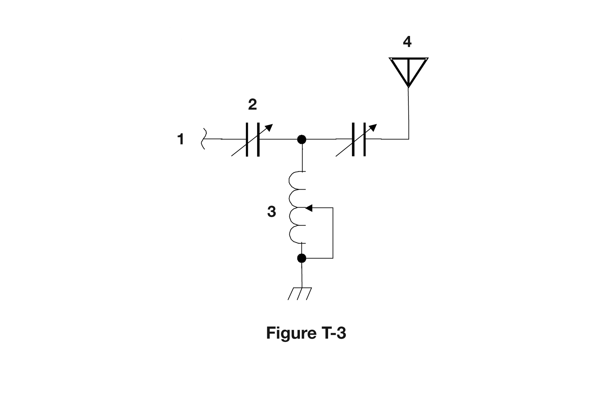

# T6 — Electronic and Electrical Components

**4 of your 35 exam questions · 4 groups (T6A–T6D) · 46 questions in the pool**

This subelement is where you learn the vocabulary of a circuit: what a resistor, capacitor, and
inductor actually do; how diodes and transistors behave; how to read a basic schematic; and what
common building blocks like relays, rectifiers, regulators, transformers, and resonant circuits are
for. There is essentially no math here — it is definitions and identification, and most answers
follow directly from what the component's name already implies once you know the pattern (resistor
resists, capacitor stores charge, inductor stores a magnetic field).

Compared to General's G6 (2 groups, 23 questions, described there as "pure component trivia"), T6
is twice the size and carries twice the exam weight (4 questions instead of 1), but it is no harder
per question — it is the same style of straightforward fact recall spread across more ground,
including an entire group (T6C) built around identifying schematic symbols in the pool's diagrams.
Learn the plain-language function of each part in T6A/T6B/T6D solidly, and for T6C, study the actual
pool figures (T-1, T-2, T-3), which are shown beside each question below, since the text alone can't
convey a schematic drawing.

## Table of Contents

- [T6A — Fixed and variable resistors; Capacitors; Inductors; Fuses; Switches; Batteries](#t6a--fixed-and-variable-resistors-capacitors-inductors-fuses-switches-batteries)
  - [All 11 pool questions for T6A](#all-11-pool-questions-for-t6a)
- [T6B — Semiconductors: basic principles and applications of solid-state devices, diodes and transistors; Gain](#t6b--semiconductors-basic-principles-and-applications-of-solid-state-devices-diodes-and-transistors-gain)
  - [All 12 pool questions for T6B](#all-12-pool-questions-for-t6b)
- [T6C — Circuit diagrams: use of schematics, basic structure; Schematic symbols of basic components](#t6c--circuit-diagrams-use-of-schematics-basic-structure-schematic-symbols-of-basic-components)
  - [All 12 pool questions for T6C](#all-12-pool-questions-for-t6c)
- [T6D — Component functions: rectifiers, relays, voltage regulators, meters, indicators, integrated circuits, transformers; Resonant circuit; Shielding](#t6d--component-functions-rectifiers-relays-voltage-regulators-meters-indicators-integrated-circuits-transformers-resonant-circuit-shielding)
  - [All 11 pool questions for T6D](#all-11-pool-questions-for-t6d)

---

## T6A — Fixed and variable resistors; Capacitors; Inductors; Fuses; Switches; Batteries

*One exam question comes from this group. 11 questions in the pool.*

**The big three passive components, by what they do:** a **resistor** opposes the flow of current in
a DC circuit; a **capacitor** stores energy in an **electric field** and is built from conductive
surfaces separated by an insulator; an **inductor** stores energy in a **magnetic field** and is
typically constructed as a **coil of wire**. A **potentiometer** is a variable resistor whose wiper
controls **resistance**, which is why it's the classic adjustable volume control.

**Switches.** An **SPDT** (single-pole, double-throw) switch connects **a single circuit to one of
two other circuits** — think of it as routing one line to either of two destinations, not opening or
closing two separate circuits. One question (T6A09) asks you to identify a switch type from
component 3 in pool figure T-2 — a diagram-recognition item; the figure is shown with the question.

**Batteries — rechargeable vs. not.** Nickel-metal hydride, lithium-ion, and lead-acid are all
**rechargeable** ("all these choices are correct" when the pool asks which chemistries recharge).
**Carbon-zinc** is the odd one out — it's a primary (non-rechargeable) cell, distinguishing it from
nickel-cadmium, lead-acid, and lithium-ion, which are all rechargeable.

#### All 11 pool questions for T6A

**T6A01**

What electrical component opposes the flow of current in a DC circuit?

- A. Inductor
- B. Resistor
- C. Inverter
- D. Transformer
-
- Answer: B

**T6A02**

What type of component is often used as an adjustable volume control?

- A. Fixed resistor
- B. Power resistor
- C. Potentiometer
- D. Transformer
-
- Answer: C

**T6A03**

What electrical parameter is controlled by a potentiometer?

- A. Inductance
- B. Resistance
- C. Capacitance
- D. Field strength
-
- Answer: B

**T6A04**

What electrical component stores energy in an electric field?

- A. Resistor
- B. Capacitor
- C. Inductor
- D. Diode
-
- Answer: B

**T6A05**

What type of electrical component consists of conductive surfaces separated by an insulator?

- A. Resistor
- B. Potentiometer
- C. Oscillator
- D. Capacitor
-
- Answer: D

**T6A06**

What type of electrical component stores energy in a magnetic field?

- A. Resistor
- B. Capacitor
- C. Inductor
- D. Diode
-
- Answer: C

**T6A07**

What electrical component is typically constructed as a coil of wire?

- A. Transistor
- B. Capacitor
- C. Diode
- D. Inductor
-
- Answer: D

**T6A08**

What is the function of an SPDT switch?

- A. A single circuit is opened or closed
- B. Two circuits are opened or closed
- C. A single circuit is switched between one of two other circuits
- D. Two circuits are each switched between one of two other circuits
-
- Answer: C

**T6A09**

What type of switch is represented by component 3 in figure T-2?

- A. Single-pole single-throw
- B. Single-pole double-throw
- C. Double-pole single-throw
- D. Double-pole double-throw
-
- Answer: A

**T6A10**

Which of the following battery chemistries is rechargeable?

- A. Nickel-metal hydride
- B. Lithium-ion
- C. Lead-acid
- D. All these choices are correct
-
- Answer: D

**T6A11**

Which of the following battery chemistries is not rechargeable?

- A. Nickel-cadmium
- B. Carbon-zinc
- C. Lead-acid
- D. Lithium-ion
-
- Answer: B

---

## T6B — Semiconductors: basic principles and applications of solid-state devices, diodes and transistors; Gain

*One exam question comes from this group. 12 questions in the pool.*

**Diodes.** A diode's forward voltage drop **is lower in some diode types than in others** (this
group doesn't ask for specific numbers, just that the drop varies by type). A diode's basic job is to
**allow current to flow in only one direction**. Its two electrodes are the **anode and cathode**,
and on the package the cathode lead is typically marked **with a stripe**. An **LED emits light when
forward current** flows through it — reverse current does not light it.

**Transistors.** A transistor is built from **three regions of semiconductor material** and can be
used as an **electronic switch** or to provide **power gain**. Bipolar junction transistors have
three electrodes — **emitter, base, and collector**. Field-effect transistors (**FET** = **Field
Effect Transistor**) instead have a **gate, drain, and source**.

**Gain.** The term "gain" in an amplifier can refer to **voltage gain, current gain, or power
gain** — the pool's answer is **"all these choices are correct,"** so don't overthink which one is
"the" definition.

#### All 12 pool questions for T6B

**T6B01**

Which is true about forward voltage drop in a diode?

- A. It is lower in some diode types than in others
- B. It is proportional to peak inverse voltage
- C. It indicates that the diode is defective
- D. It has no impact on the voltage delivered to the load
-
- Answer: A

**T6B02**

What electronic component allows current to flow in only one direction?

- A. Resistor
- B. Fuse
- C. Diode
- D. Driven element
-
- Answer: C

**T6B03**

Which of these components can be used as an electronic switch?

- A. Varistor
- B. Potentiometer
- C. Transistor
- D. Thermistor
-
- Answer: C

**T6B04**

Which of the following components can consist of three regions of semiconductor material?

- A. Alternator
- B. Transistor
- C. Triode
- D. Pentode
-
- Answer: B

**T6B05**

What type of transistor has a gate, drain, and source?

- A. Varistor
- B. Field-effect
- C. Hall-effect
- D. Bipolar junction
-
- Answer: B

**T6B06**

How is the cathode lead of a semiconductor diode often marked on the package?

- A. With the word "cathode"
- B. With a stripe
- C. With the letter C
- D. With the letter K
-
- Answer: B

**T6B07**

What causes a light-emitting diode (LED) to emit light?

- A. Forward current
- B. Reverse current
- C. Capacitively-coupled RF signal
- D. Inductively-coupled RF signal
-
- Answer: A

**T6B08**

What does the abbreviation FET stand for?

- A. Frequency Emission Transmitter
- B. Fast Electron Transistor
- C. Free Electron Transmitter
- D. Field Effect Transistor
-
- Answer: D

**T6B09**

What are the names for the electrodes of a diode?

- A. Plus and minus
- B. Source and drain
- C. Anode and cathode
- D. Gate and base
-
- Answer: C

**T6B10**

Which of the following can provide power gain?

- A. Transformer
- B. Transistor
- C. Reactor
- D. Resistor
-
- Answer: B

**T6B11**

What does the term gain mean in amplifiers?

- A. The output signal voltage relative to the input signal voltage
- B. The output signal current relative to the input signal current
- C. The output signal power relative to the input signal power
- D. All these choices are correct
-
- Answer: D

**T6B12**

What are the names of the electrodes of a bipolar junction transistor?

- A. Signal, bias, power
- B. Emitter, base, collector
- C. Input, output, supply
- D. Pole one, pole two, output
-
- Answer: B

---

## T6C — Circuit diagrams: use of schematics, basic structure; Schematic symbols of basic components

*One exam question comes from this group. 12 questions in the pool.*

**A schematic** is an electrical diagram that uses **standard component symbols** to represent a
circuit. Critically, a schematic accurately represents **component connections** — it does *not*
represent wire lengths or the physical appearance of the parts; it's a logical map, not a scale
drawing.

**Symbol recognition dominates this group** — nine of its twelve questions ask you to identify a
numbered component in one of the pool's three figures (T-1, T-2, and T-3). Those questions
(T6C02–T6C10, plus T6D10 in the next group) can't be answered from text alone; study the figures
shown with each question to learn to recognize the standard symbols
for a resistor, battery, lamp, ground, transistor, capacitor, regulator IC, LED, variable resistor,
transformer, variable inductor, and antenna. The text below reproduces each question exactly as
written, with the figure shown above its answer choices.

#### All 12 pool questions for T6C

**T6C01**

What is an electrical diagram using standard component symbols called?

- A. Connection chart
- B. Instrumentation system
- C. Schematic
- D. Flow chart
-
- Answer: C

**T6C02**

What is component 1 in figure T-1?

- A. Resistor
- B. Transistor
- C. Battery
- D. Connector
-
- Answer: A

**T6C03**

What is component 2 in figure T-1?

- A. Resistor
- B. Transistor
- C. Indicator lamp
- D. Connector
-
- Answer: B

**T6C04**

What is component 3 in figure T-1?

- A. Resistor
- B. Transistor
- C. Lamp
- D. Ground symbol
-
- Answer: C

**T6C05**

What is component 4 in figure T-1?

- A. Resistor
- B. Transistor
- C. Ground symbol
- D. Battery
-
- Answer: D

**T6C06**

What is component 6 in figure T-2?

- A. Resistor
- B. Capacitor
- C. Regulator IC
- D. Transistor
-
- Answer: B

**T6C07**

What is component 8 in figure T-2?

- A. Resistor
- B. Inductor
- C. Regulator IC
- D. Light emitting diode
-
- Answer: D

**T6C08**

What is component 9 in figure T-2?

- A. Variable capacitor
- B. Variable inductor
- C. Variable resistor
- D. Variable transformer
-
- Answer: C

**T6C09**

What is component 4 in figure T-2?

- A. Variable inductor
- B. Double-pole switch
- C. Potentiometer
- D. Transformer
-
- Answer: D

**T6C10**

What is component 3 in figure T-3?

- A. Connector
- B. Meter
- C. Variable capacitor
- D. Variable inductor
-
- Answer: D

**T6C11**

What is component 4 in figure T-3?

- A. Antenna
- B. Transmitter
- C. Dummy load
- D. Ground
-
- Answer: A

**T6C12**

Which of the following is accurately represented in electrical schematics?

- A. Wire lengths
- B. Physical appearance of components
- C. Component connections
- D. All these choices are correct
-
- Answer: C

---

## T6D — Component functions: rectifiers, relays, voltage regulators, meters, indicators, integrated circuits, transformers; Resonant circuit; Shielding

*One exam question comes from this group. 11 questions in the pool.*

**Function words to keep straight:** a **rectifier** changes alternating current into a varying
direct current signal. A **relay** is an **electrically-controlled switch**. A **regulator** circuit
controls the amount of voltage coming from a power supply. A **transformer** changes 120 V AC power
to a lower AC voltage for other uses. A **meter** displays an electrical quantity as a numeric value.
An **integrated circuit** combines several semiconductors and other components into a single
package.

**Shielded wire** is used to **prevent coupling of unwanted signals to or from the wire** — it's
about keeping interference out (or in), not about current capacity or DC resistance. A **resonant
(tuned) circuit** is formed by combining an **inductor and a capacitor**, in series or parallel — the
same L-C pairing that shows up throughout the pool. For visual indication, the pool's answer is
specifically the **LED** (not "all these choices," despite FET and Zener diode appearing as
distractors — only the LED is actually an indicator here). One question (T6D10) also reaches back
into figure T-1 to ask what component 2 *does*, functionally, rather than what it's called.

#### All 11 pool questions for T6D

**T6D01**

Which of the following devices or circuits changes an alternating current into a varying direct current signal?

- A. Transformer
- B. Rectifier
- C. Amplifier
- D. Reflector
-
- Answer: B

**T6D02**

What is a relay?

- A. An electrically-controlled switch
- B. A current-controlled amplifier
- C. An inverting amplifier
- D. A pass transistor
-
- Answer: A

**T6D03**

Which of the following is a reason to use shielded wire?

- A. To decrease the resistance of DC power connections
- B. To increase the current carrying capability of the wire
- C. To prevent coupling of unwanted signals to or from the wire
- D. To reduce receiver overload
-
- Answer: C

**T6D04**

Which of the following displays an electrical quantity as a numeric value?

- A. Potentiometer
- B. Transistor
- C. Meter
- D. Relay
-
- Answer: C

**T6D05**

What type of circuit controls the amount of voltage from a power supply?

- A. Regulator
- B. Oscillator
- C. Filter
- D. Phase inverter
-
- Answer: A

**T6D06**

What component changes 120 V AC power to a lower AC voltage for other uses?

- A. Variable capacitor
- B. Transformer
- C. Transistor
- D. Diode
-
- Answer: B

**T6D07**

Which of the following is commonly used as a visual indicator?

- A. LED
- B. FET
- C. Zener diode
- D. All these choices are correct
-
- Answer: A

**T6D08**

Which of the following is combined with an inductor to make a resonant circuit?

- A. Resistor
- B. Zener diode
- C. Potentiometer
- D. Capacitor
-
- Answer: D

**T6D09**

What is the name of a device that combines several semiconductors and other components into one package?

- A. Transducer
- B. Multi-pole relay
- C. Integrated circuit
- D. Transformer
-
- Answer: C

**T6D10**

What is the function of component 2 in figure T-1?

- A. Give off light when current flows through it
- B. Supply electrical energy
- C. Control the flow of current
- D. Convert electrical energy into radio waves
-
- Answer: C

**T6D11**

Which of the following is a resonant or tuned circuit?

- A. An inductor and a capacitor in series or parallel
- B. A linear voltage regulator
- C. A resistor circuit used for reducing standing wave ratio
- D. A circuit designed to provide high-fidelity audio
-
- Answer: A
